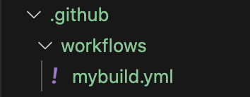
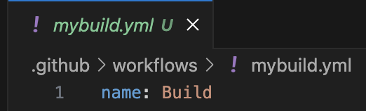
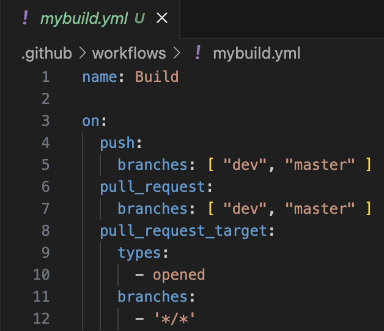

# Github Actions & Workflows
## Build and Test with Node.js
### See the offical doc [here](https://docs.github.com/en/actions/use-cases-and-examples/building-and-testing/building-and-testing-nodejs).

This repository contains the Brightlayer-UI React Routing template starter project and is the starting point for experimenting with Github Actions & Workflows. For this projects continuous integration (CI) we will focus only on the actions / workflow and the available scripts in package.json.

There are two ways to implement the (CI) .yml file for any project in github, the first way is to create and edit the workflow .yml file in the actions tab in the repository and the second way is to commit & push the .yml file. For this we will just commit the .yml in to your new repository via a pull request and the workflow will be triggered to run once everything is setup.

-   Clone this repository and <ins>create a new repository under your github profile.</ins>
```
git clone https://github.com/JeffGreiner-eaton/react-routing-action-workflow.git

```
-   Clone down your new repository that was created and in the root of the project create a hidden folder `.github`. After creating the .github folder create a sub-folder in the .github called `workflows`.

-   Create a new file in workflows folder called `mybuild.yml` or similar.



-   To help author the .yml you can install the VS Code extension GitHub Actions v0.26.X
-   In the new .yml file, the first line will contain the workflow name and will be displayed in the github repository actions once the first workflow runs. On your first line of the .yml add ``` name: Build ```



-   In the next section of the .yml workflow file we will setup the `on:` trigger events that will trigger the workflow to run. For Brightlayer-UI we tend to use three event types:
- ` on: push:`
- ` on: pull_request:`
- ` on: pull_request_target:`

-   On line 3 add the key `on:` and event types.
```yaml
on:
  push:
    branches: [ "dev", "master" ]
  pull_request:
    branches: [ "dev", "master" ]
  pull_request_target:
    types:
      - opened
    branches:
      - '*/*'
```

See the office docs [here](https://docs.github.com/en/actions/writing-workflows/workflow-syntax-for-github-actions#on) for additional event types.

-   The workflow .yml file is now setup with run name and on: trigger event types.



# Getting Started with Create React App

This project was bootstrapped with [Create React App](https://github.com/facebook/create-react-app).

## Available Scripts

In the project directory, you can run:

### `yarn start`

Runs the app in the development mode.\
Open [http://localhost:3000](http://localhost:3000) to view it in the browser.

The page will reload if you make edits.\
You will also see any lint errors in the console.

### `yarn test`

Launches the test runner in the interactive watch mode.\
See the section about [running tests](https://facebook.github.io/create-react-app/docs/running-tests) for more information.

### `yarn build`

Builds the app for production to the `build` folder.\
It correctly bundles React in production mode and optimizes the build for the best performance.

The build is minified and the filenames include the hashes.\
Your app is ready to be deployed!

See the section about [deployment](https://facebook.github.io/create-react-app/docs/deployment) for more information.